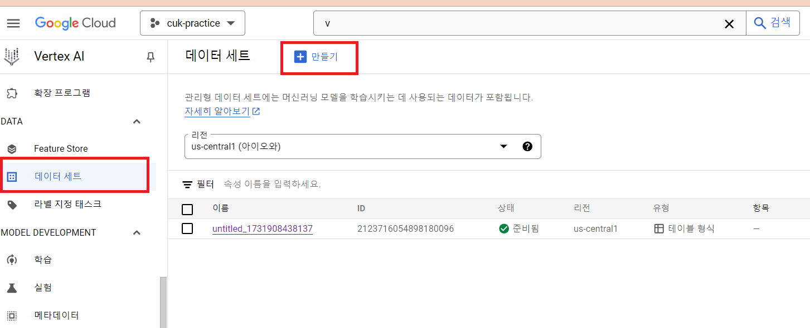
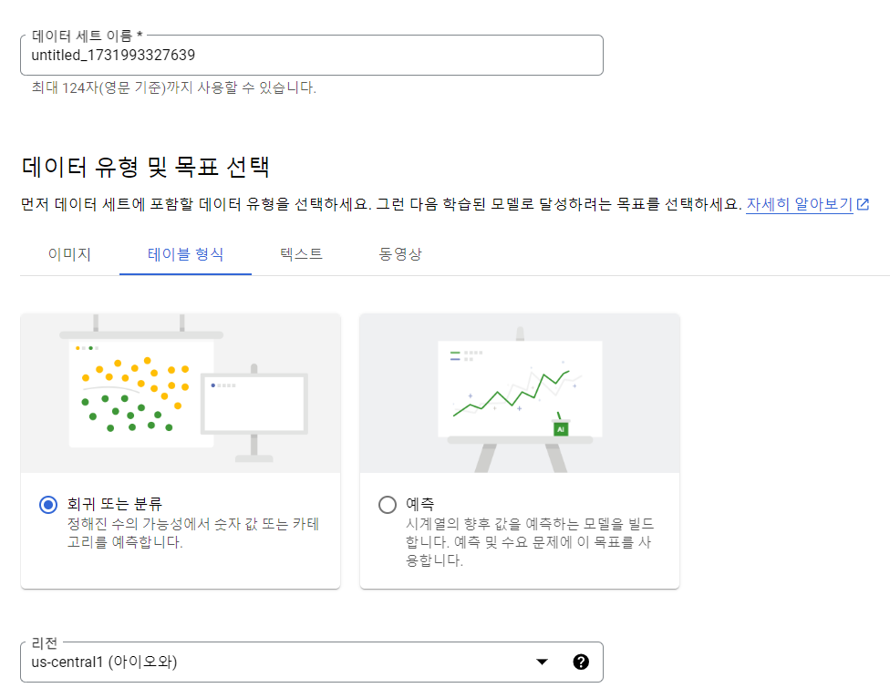
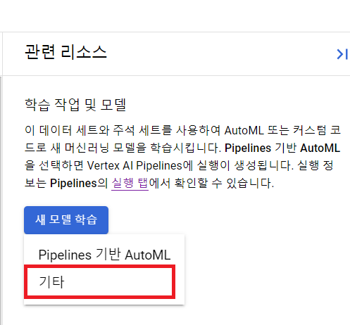
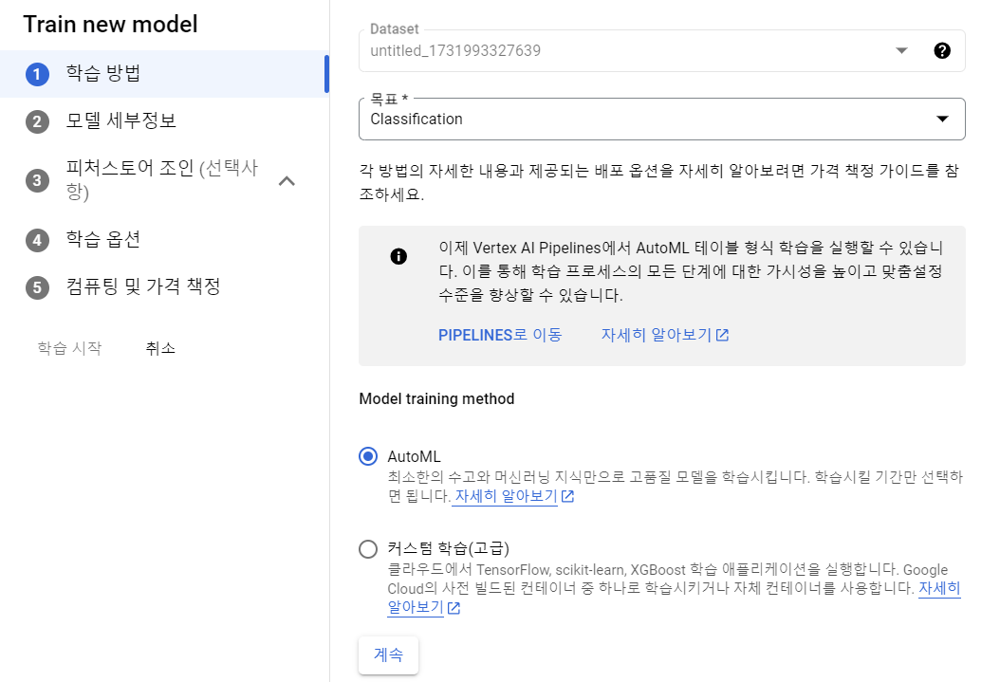
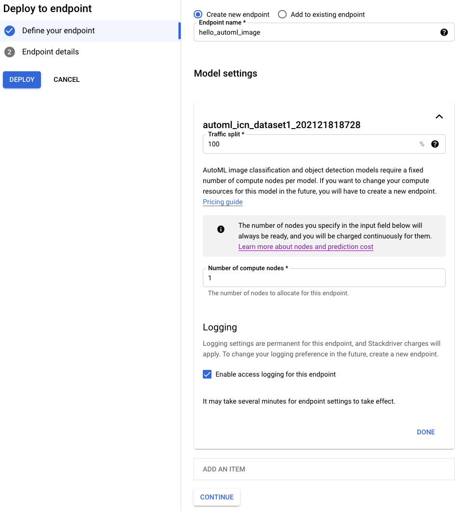
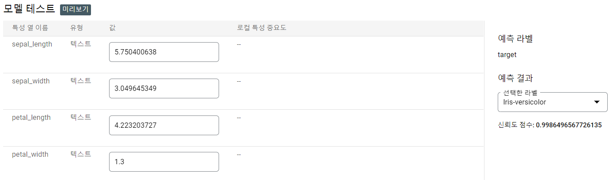

# Google Vertex AI로 ML 분석하기

## 유의 사항
- Google AI와 같은 경우 무료계정에서 지원되지 않으니, 실습과정을 지켜보고, 이해만 하시길 바랍니다. 


## AutoML을 이용한 iris data 분류하기
- 참고 : https://cloud.google.com/vertex-ai

## 프로젝트 및 환경설정

- https://console.cloud.google.com/ 에 접속한다.

- AI 분석을 수행할 프로젝트를 생성 또는 선택한다. 


## 학습데이터 셋 만들기


- Google Cloud Console을 사용하여 Vertex AI 대시보드로 접속
- 데이터 세트가 생성된 후 공개 Cloud Storage 버킷의 이미지를 가리키는 CSV를 사용하여 해당 이미지를 데이터 세트로 가져옴
- 입력 데이터셋은 Cloud Storage 버킷에 저장되 있음

1. Vertex AI 페이지 시작하기 페이지에서 데이터 세트 만들기를 클릭
 

2. 이 데이터 세트의 이름을 지정(선택 사항)
3. '데이터 유형 및 목표 선택' 섹션의 테이블 형식 탭에서 radio_button_checked 회귀 또는 분류 라디오 옵션을 선택합니다. 리전 드롭다운 메뉴에서 US Central을 선택

4. 만들기를 선택하여 빈 데이터 세트 생성
5. 컴퓨터에서 CSV 파일 업로드를 선택하고 파일 선택을 눌러 iris-data set을 업로드
6. 업로드된 CSV 파일을 저장할 Cloud Storage 위치 선택

## AutoML 이미지 분로 모델 학습

1. 새 모델 학습 -> 기타 (no pipeline 기반의 AutoML)
 - 
2. AutoML 모델 학습 시작
 - 모델 페이지로 이동하여 모델 만들기로 AutoML 모델 생성
 
 - 다음 '모델 정의' 섹션에서 모델 이름 필드(선택사항)에 정보를 입력한 다음 계속을 선택
 - 마지막 '컴퓨팅 및 가격 책정'에서 노드 시간 예산을 8 노드 시간으로 지정
  

## 엔드포인트에 모델 배포

1. 모델 페이지로 이동하여 학습이 끝난 모델을 선택하여 모델 성능을 확인
2. 배포 및 테스트 탭을 선택하여 엔드포인트를 생성 준비
3. 동일한 '엔드포인트 정의' 섹션에서 트래픽 분할을 100%로 수락하고 컴퓨팅 노드 수를 컴퓨팅 노드 1개로 설정

4. '엔드포인트 세부정보' 섹션에서 배포를 클릭하여 새 엔드포인트를 생성


## 모델 예측

1. 엔드포인트 생성 프로세스가 완료되면 Cloud Console에서 단일 이미지 주석(예측) 요청을 보낼 수 있음
2. 이전 단계에서 엔드포인트를 만드는 데 사용한 동일한 배포 및 테스트 탭의 '모델 테스트' 섹션으로 이동
  - 직접 컬럼 데이터를 입력하여 모델을 테스트
   

  - API를 통한 모델 추론

  ```
  ENDPOINT_ID="4718348541926309888"
  PROJECT_ID="351934917431"
  INPUT_DATA_FILE="iris-input.json"

  curl \
  -X POST \
  -H "Authorization: Bearer $(gcloud auth print-access-token)" \
  -H "Content-Type: application/json" \
  "https://us-central1-aiplatform.googleapis.com/v1/projects/${PROJECT_ID}/locations/us-central1/endpoints/${ENDPOINT_ID}:predict" \
  -d "@${INPUT_DATA_FILE}"

  ```

  - 추론 데이터 
  ```
  {
    "instances": [
        { "petal_length": "1.4", "petal_width": "0.2", "sepal_length": "5.1", "sepal_width": "3.5" },
        { "petal_length": "1.3", "petal_width": "0.2", "sepal_length": "4.9", "sepal_width": "3.0" },
        { "petal_length": "1.5", "petal_width": "0.3", "sepal_length": "4.7", "sepal_width": "3.2" },
        { "petal_length": "4.7", "petal_width": "1.4", "sepal_length": "6.7", "sepal_width": "3.0" },
        { "petal_length": "5.1", "petal_width": "1.8", "sepal_length": "6.3", "sepal_width": "2.8" }
    ]
  }

  ```

